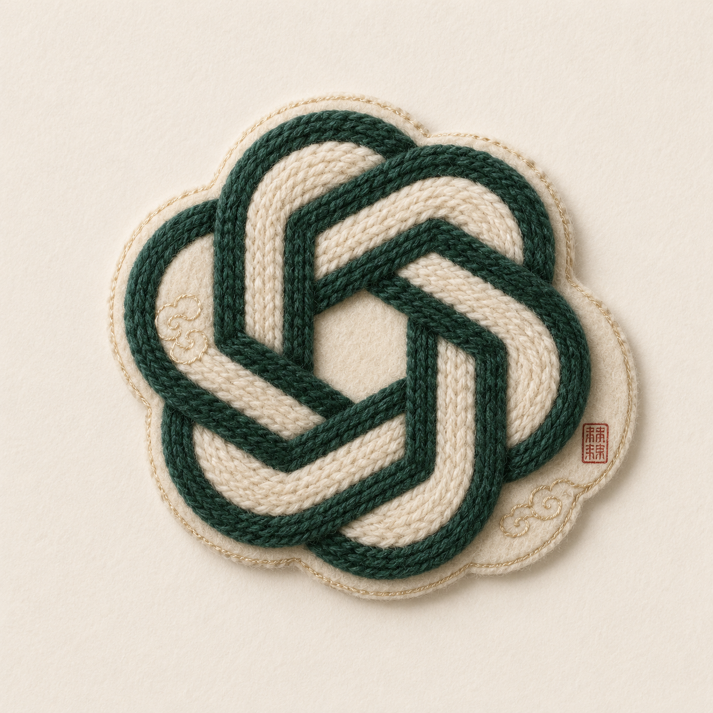
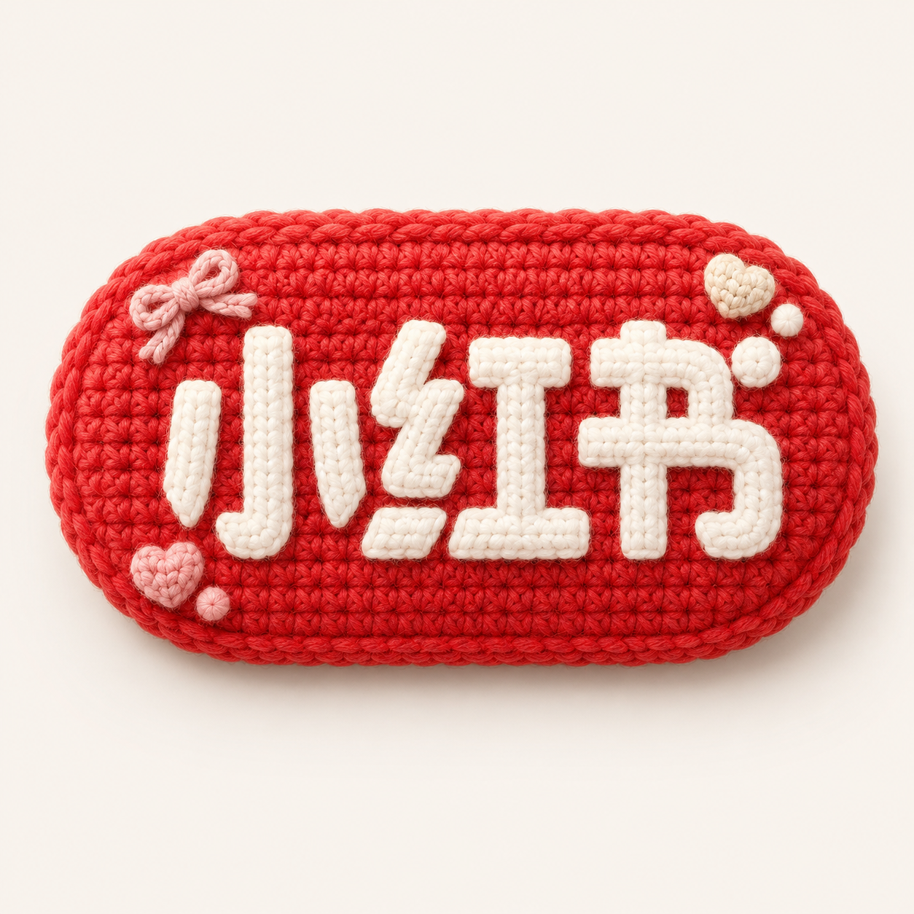
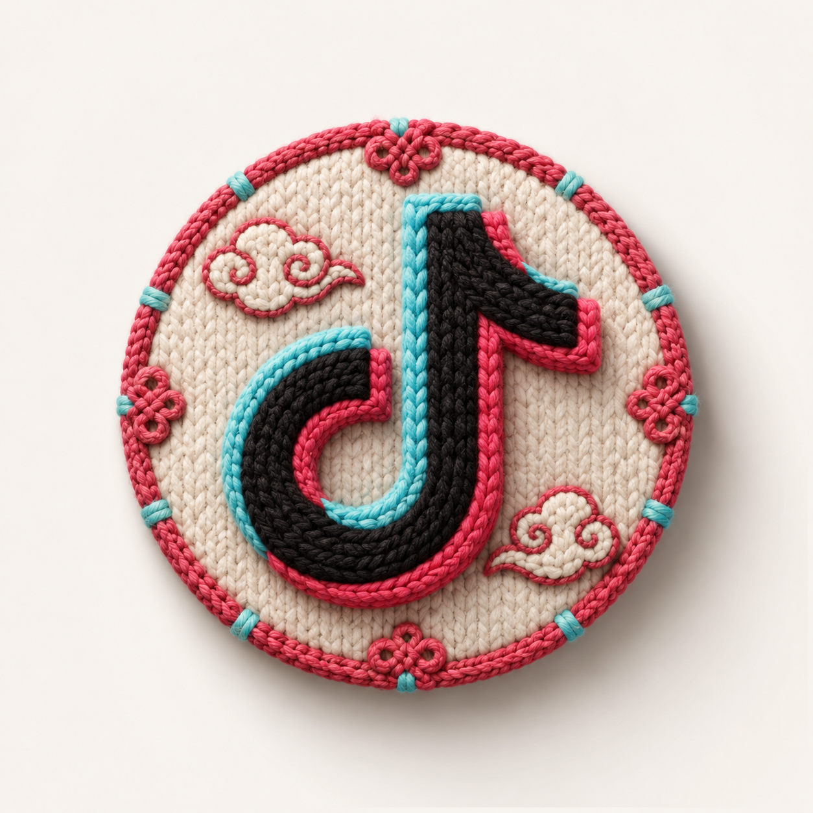
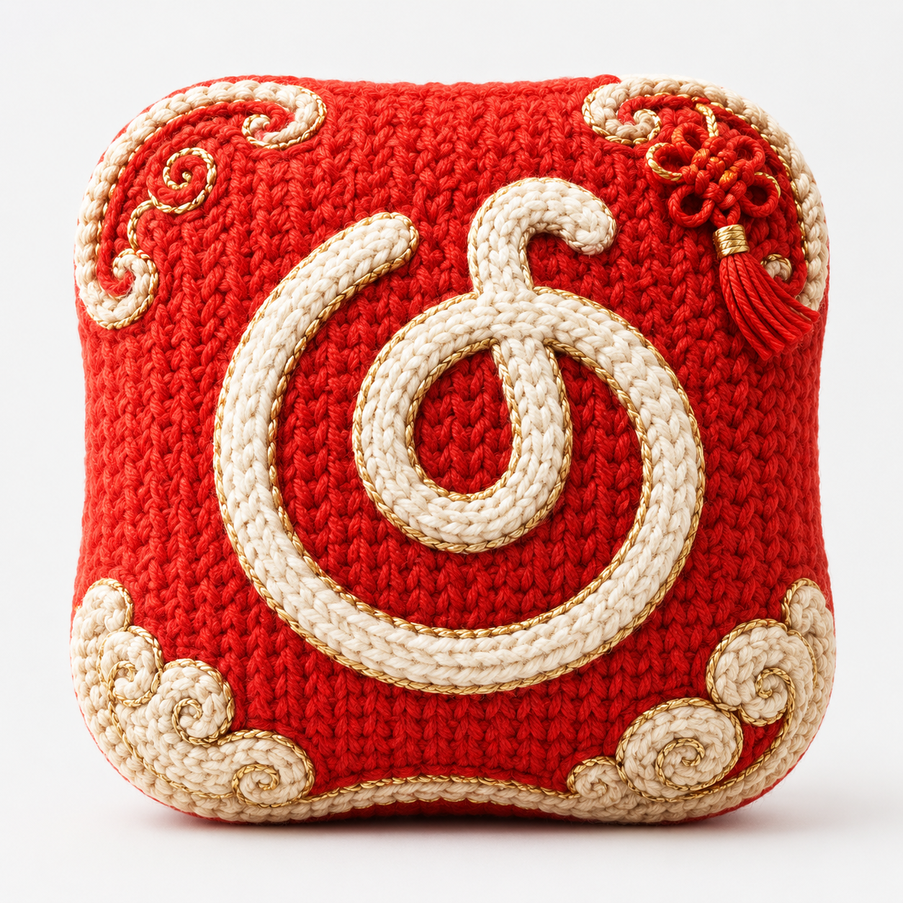
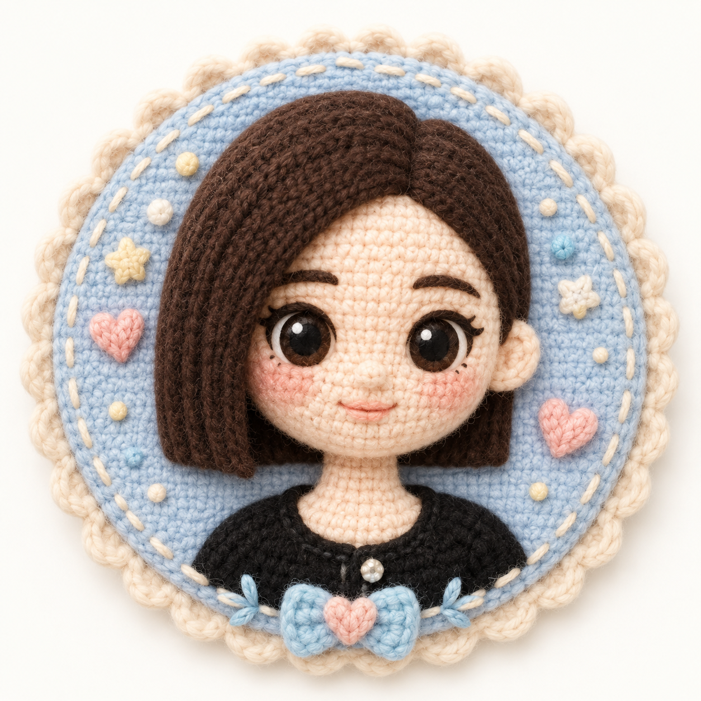

<div align="center">

# 🧶 Knitted Logo Studio
### A style-driven skill for transforming logos into soft 3D knitted badge visuals

<p>
  
  
  
  
</p>

**Knitted Logo Studio** is a prompt/skill package designed to transform uploaded logos into polished **knitted, yarn-based, soft 3D badge-style visuals**.

It emphasizes **logo recognizability**, **material believability**, **style selection**, and **creative presentation quality**.

[中文说明](./README.zh-CN.md)

</div>

---

## ✨ What this skill does

- Preserves the original logo's core silhouette and recognizability
- Reinterprets the logo as a **soft 3D knitted emblem**
- Automatically recommends **2–3 fitting styles** if the user does not specify one
- Supports **Chinese-character enhancement** and other creative style directions
- Keeps the result suitable for **social sharing, concept mockups, and design showcases**

---

## 🧠 Core workflow

### 1. Logo analysis
The skill first analyzes the uploaded logo:
- structure;
- complexity;
- color logic;
- brand mood;
- whether it is a wordmark, icon, or combination mark.

### 2. Style recommendation
If the user does **not** specify a style, the skill recommends **2–3 suitable directions** with short explanations.

Users can then:
- reply **1 / 2 / 3**;
- name another style;
- or let the system automatically pick the best option.

### 3. Final rendering
The selected direction is rendered into a polished **knitted logo concept image**.

---

## 🎨 Built-in primary styles

- **Chinese Contemporary** — modern Chinese-inspired cultural design language
- **Minimal Nordic** — calm, premium, low-saturation minimal knit
- **Vintage Collegiate** — sweater badge / varsity crest vibe
- **Soft Cute** — plush, rounded, social-friendly charm
- **Street Patch** — stitched, urban, fashion-forward badge energy
- **Outdoor Craft** — utility textile, rope, woven outdoor feel
- **Luxury Knit** — refined yarn, boutique presentation, elegant accents
- **Future Knit** — soft tech aesthetic with structured futuristic styling

---

## 🇨🇳 Chinese-character enhancement

The skill can strengthen Chinese characteristics **without overwhelming the logo**.

Possible directions include:
- cloud motifs;
- ruyi motifs;
- subtle knot details;
- seal-like accents;
- gold-thread highlights;
- palettes inspired by vermilion, jade green, bamboo green, indigo, warm ivory, and muted gold.

The result aims to feel like a **contemporary cultural knitted badge**, not a cluttered festival poster.

---

## 📁 Repository structure

```text
knitted-logo-style-skill/
├─ skill.md
├─ README.md
├─ README.zh-CN.md
├─ LICENSE.md
├─ COMMERCIAL-LICENSE.md
└─ assets/
   └─ examples/
      ├─ case-1.png
      ├─ case-2.png
      ├─ case-3.png
      ├─ case-4.png
      ├─ case-5.png
      └─ case-6.png
```

---

## 🖼 Showcase placeholders

> Replace the placeholder files in `assets/examples/` with your own showcase images while keeping the same filenames for instant README compatibility.

<p align="center">
  
  
  
  <br>
  
  
  
</p>

---

## 🚀 Suggested usage

1. Upload a logo reference image.
2. If you already know the style, specify it directly.
3. If not, let the skill recommend 2–3 suitable options.
4. Choose one or let the system decide.
5. Generate the final knitted logo visual.

---

## 📝 Notes

- `skill.md` contains the main skill rules and generation logic.
- `LICENSE.md` covers the default non-commercial/personal use terms.
- `COMMERCIAL-LICENSE.md` reserves the commercial licensing path.
- Replace the six placeholder showcase files with your real output examples.

---

## 📜 License

This repository is provided under the terms described in **[LICENSE.md](./LICENSE.md)**.
For commercial use, see **[COMMERCIAL-LICENSE.md](./COMMERCIAL-LICENSE.md)**.
